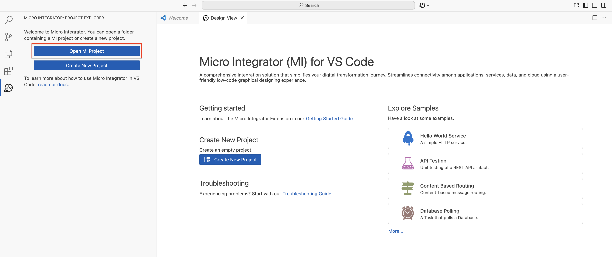
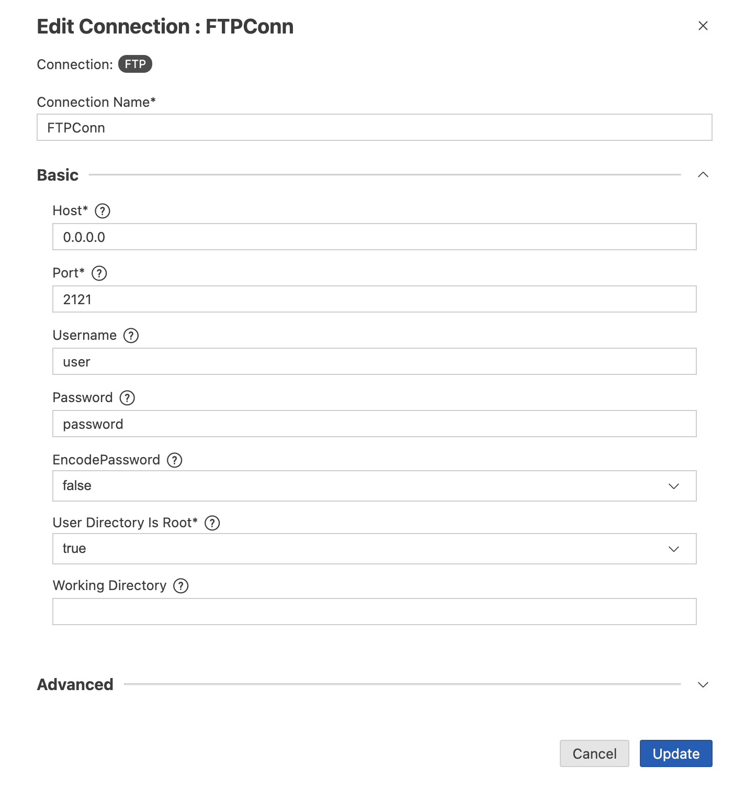
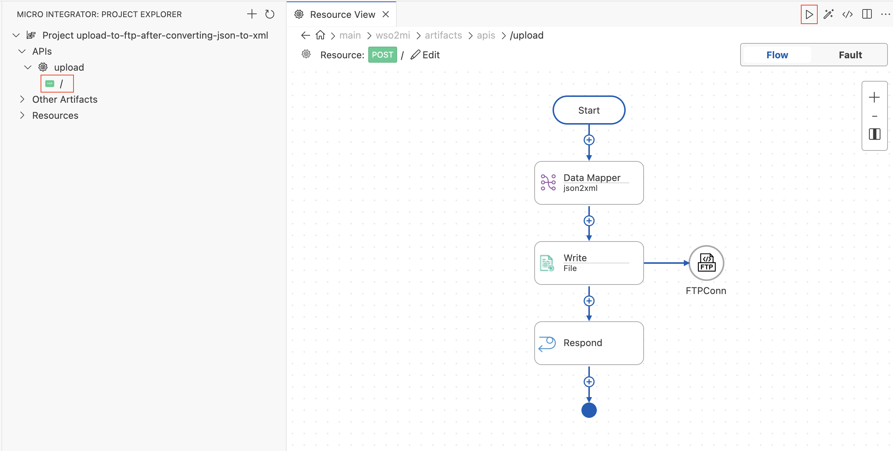

# Upload to FTP after converting JSON to XML

This example application illustrates the concept of data mapping to convert JSON data to XML. It also shows you how to configure and use the [File connector](https://mi.docs.wso2.com/en/latest/reference/connectors/file-connector/file-connector-overview/) to upload a file to an FTP server.

### Assumptions ###

This document assumes that you are familiar with WSO2 MI and the [WSO2 MI VS Code Extension](https://mi.docs.wso2.com/en/latest/develop/mi-for-vscode/install-wso2-mi-for-vscode/). To increase your familiarity with WSO2 MI, consider completing one or more [WSO2 MI Tutorials](https://mi.docs.wso2.com/en/latest/learn/learn-overview/).

### Example Use Case
In this example, JSON data is sent to the application and then converted to XML format using the DataMapper. The message payload is then uploaded to the FTP folder.


### Set Up and Run the Example

1. Install WSO2 Micro Integrator by following the [WSO2 MI Installation Guide](https://mi.docs.wso2.com/en/latest/develop/mi-for-vscode/install-wso2-mi-for-vscode/).

2. Open the MI-VS Code extension and click "Open MI Project".


3. Browse to the file path of the downloaded sample from this GitHub project (`integration-studio-examples/migration/mule/upload-to-ftp-after-converting-json-to-xml`) and click **Open MI Project**.

4. Go to **Connections -> FTPConn** and configure the FTP connection parameters.
 

5. Go to **API -> upload** and run the API by clicking on the **run** icon.
 

6. Make a POST request to *http://localhost:8290/upload* with the following JSON message body, setting the `Content-Type` header to `application/json`:
    ```json
    {
    	"employees": {
    		"employee": [{
    				"name": "John",
    				"lastName": "Doe",
    				"addresses": {
    					"address": [{
    							"street": "123 Main Street",
    							"zipCode": "111"
    						},
    						{
    							"street": "987 Cypress Avenue",
    							"zipCode": "222"
    						}
    					]
    				}
    			},
    			{
    				"name": "Jane",
    				"lastName": "Doe",
    				"addresses": {
    					"address": [{
    							"street": "345 Main Street",
    							"zipCode": "111"
    						},
    						{
    							"street": "654 Sunset Boulevard",
    							"zipCode": "333"
    						}
    					]
    				}
    			}
    		]
    	}
    }
    ```

7. Verify that the file `miExample.xml` was uploaded to the `upload` folder on your FTP server.

### Go Further

* Learn more about [data mapping](https://mi.docs.wso2.com/en/latest/reference/mediators/data-mapper-mediator/).
* Learn more about the [file connector](https://mi.docs.wso2.com/en/latest/reference/connectors/file-connector/file-connector-example/).
